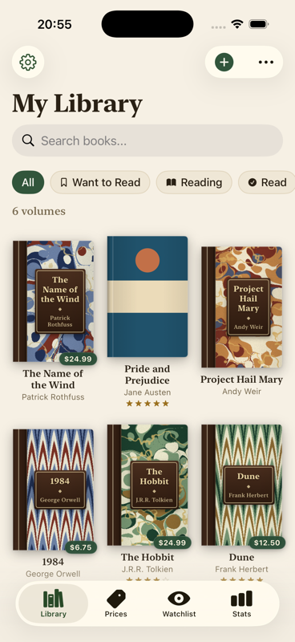
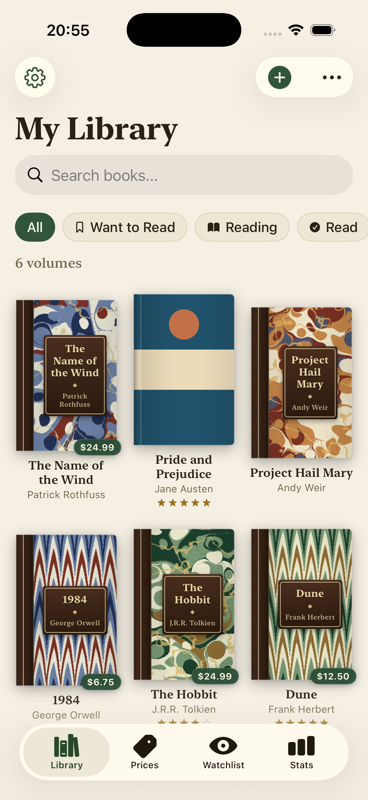
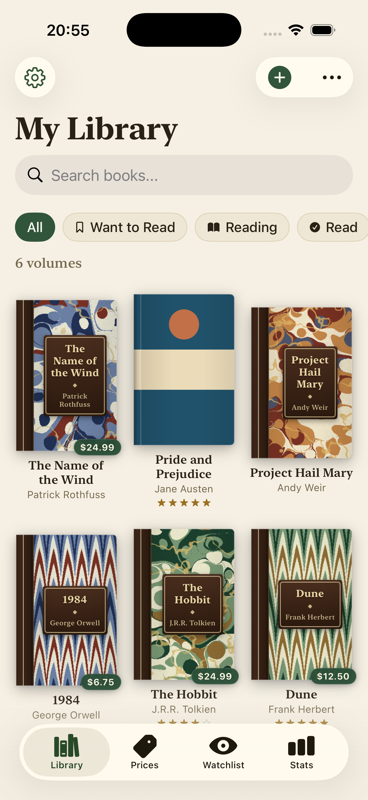
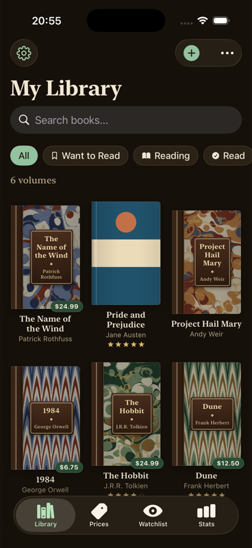
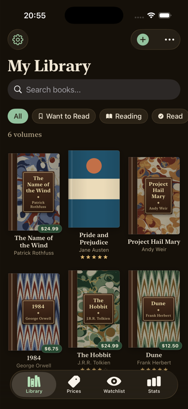

# Library

An iOS app for cataloging a personal book collection and tracking what your books are worth on eBay.

Point your camera at a barcode (or snap a photo of a title page), and the app looks the book up, downloads its cover and metadata, and tracks its lowest current eBay price over time. Share an eBay listing straight into the app to watch a book you don't own yet.

| Library | Prices | Watchlist |
|---|---|---|
|  |  |  |
|  |  |  |

## Features

- **Barcode scanning** — single and batch modes built on `DataScannerViewController`, with ISBN-10 → ISBN-13 conversion and UPC fallback lookup
- **Title-page OCR** — Vision framework text recognition with layout-aware parsing: text size and page position are used to guess which lines are the title and author
- **Book metadata lookup** — Google Books with Open Library fallback, merged results, cover downloads
- **eBay price tracking** — OAuth client-credentials flow against the eBay Browse API, progressively broader search strategies (ISBN → title+author → title), per-book price history charts (Swift Charts), and price-movement indicators ("↓ $3.50 since the price changed") derived from stored history
- **Share extension** — share an eBay listing from Safari or the eBay app; the extension parses the item ID, hands it to the main app via an App Group container, and the app enriches it into a watched book (real listing title → book match → market price)
- **Watchlist** — track prices for books you don't own; graduate them into your library with price history intact
- **Price check mode** — scan a book in a store and see its eBay price without adding it
- **Library management** — grid/list views, search, reading status, star ratings, notes, duplicate detection, copy counts
- **Reading stats** — books per month, reading pace, all-time totals
- **Export** — CSV or JSON backup with proper CSV escaping

## Design

The UI uses a warm, editorial design language ("Athenaeum"): ivory paper surfaces, ink text, library green and brass, and serif display type — dark mode reads as a lamp-lit study. Books without cover art get procedurally generated bindings: cloth covers with gilt frames, and for some titles, half-leather bindings with marbled paper boards. The marbling uses classical "mathematical marbling" — ink drops and comb strokes resolved per-pixel by inverting the operation sequence — in three period patterns: stone with gilt veins (boards), nonpareil chevrons (boards), and bouquet flame arches (endpapers behind the book detail header). Rendering is deterministic (seeded by book title), parallelized across rows, and cached, so a given book keeps the same sheet forever. The app icon and launch motif are generated by `tools/generate_icon.swift` from the same marbling math — run `swift tools/generate_icon.swift` (CoreGraphics only, no dependencies).

## Architecture

Swift 5 / SwiftUI / SwiftData, iOS 17+, no third-party dependencies.

```
Library/
├── Models/          SwiftData @Model classes (Book, WatchedBook, price history)
│                    + Codable API response models
├── Services/        actor-isolated network services (Google Books, Open Library,
│                    eBay), OCR, duplicate detection, export
├── Utilities/       ISBN validation/conversion, eBay title cleaning, price
│                    formatting, theme + marbled-paper renderer, App Group
│                    container, os.Logger setup
└── Views/           SwiftUI views grouped by feature
LibraryShareExtension/   share extension target (eBay listing ingestion)
LibraryTests/            unit tests (Swift Testing)
```

Notes on the design:

- Network services are `actor`s; the project uses Swift's default-MainActor isolation mode (`SWIFT_DEFAULT_ACTOR_ISOLATION = MainActor`), with API response models and pure utilities explicitly `nonisolated`.
- `BookLookupService` is an `@Observable` coordinator that fans out to the services and exposes search state to SwiftUI.
- The share extension and main app communicate through a JSON file in an App Group container — the extension stays tiny and the app does the heavy enrichment on next launch/foreground.
- API keys are user-supplied at runtime (Settings tab) and stored in `UserDefaults`; nothing is baked into the binary or the repo.

## Building

Open `Library.xcodeproj` in Xcode 16+ and run the **Library** scheme. The app builds and runs in the simulator; camera-based features (barcode scanning, OCR capture) need a physical device.

To explore the UI without adding real books, launch a DEBUG build with the `-seedSampleData YES` argument (Edit Scheme → Run → Arguments) to populate a demo library.

To use the share extension on a device, set your own App Group ID in both targets' Signing & Capabilities and update `SharedContainer.appGroupID` to match.

### API keys

- **Google Books** — works without a key (lower rate limits). Optional key from [Google Cloud Console](https://console.cloud.google.com).
- **eBay** — required for pricing. Create an app in the [eBay Developer Program](https://developer.ebay.com) and enter the production Client ID + Secret in the app's Settings tab (or paste a pre-generated App Token). The app handles the OAuth client-credentials flow and token refresh itself.

## Testing

```sh
xcodebuild -project Library.xcodeproj -scheme Library \
  -destination 'platform=iOS Simulator,name=iPhone 17' test
```

72 unit tests (Swift Testing) cover the logic that's easy to get wrong:

- ISBN-10/13 check-digit validation, ISBN-10 → ISBN-13 conversion, scanned-barcode interpretation
- eBay listing-title cleaning (edition/format/condition noise stripping)
- Price-movement computation behind the delta badges
- Marbled-binding assignment (deterministic seeding, colorway distribution, render caching)
- Duplicate detection (ISBN and title+author matching) against an in-memory SwiftData store
- CSV/JSON export, including CSV escaping of commas, quotes, and newlines
- eBay item-ID extraction from shared listing URLs
- API response decoding for all three services
- OCR ISBN extraction and title-page parsing heuristics
